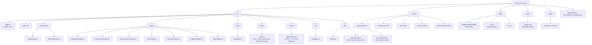

# Project Structure Diagram

```mermaid
flowchart TD
    A[Family_Pay_App] --> B[src]
    A --> C[screens]
    A --> D[public]
    A --> E[assets]
    A --> F[scripts]
    A --> G[package.json / vite.config.ts / tsconfig*.json]

    B --> B1[App.tsx\nRouter מרכזי]
    B --> B2[index.css]
    B --> B3[components]
    B --> B4[pages]
    B --> B5[data]
    B --> B6[types]
    B --> B7[context]
    B --> B8[lib]
    B --> B9[utils]

    B3 --> B31[TopAppBar.tsx]
    B3 --> B32[BottomNavBar.tsx]

    B4 --> B41[DashboardPage.tsx]
    B4 --> B42[TransactionsPage.tsx]
    B4 --> B43[AddTransactionPage.tsx]
    B4 --> B44[UsersPage.tsx]
    B4 --> B45[SummaryPage.tsx]
    B4 --> B46[AnalyticsPage.tsx]
    B4 --> B47[ImportPage.tsx]

    B5 --> B51[mockData.ts]
    B6 --> B61[index.ts\nUser / Card / Transaction / MonthlySummary]
    B7 --> B71[AppContext.tsx\nמצב מרכזי + פעולות Supabase]
    B8 --> B81[supabase.ts]

    B9 --> B91[format.ts]
    B9 --> B92[summaryUtils.ts\nחישוב חובות לפי בעל כרטיס]
    B9 --> B93[parseMaxXlsx.ts\nפירסור XLSX מ-MAX]

    C --> C1[dashboard.html]
    C --> C2[transactions.html]
    C --> C3[users.html]
    C --> C4[summary.html]
    C --> C5[add-transaction.html]

    D --> D1[manifest.webmanifest\nPWA config]
    D --> D2[sw.js\nService Worker]
    D --> D3[icons/]

    E --> E1[banner.svg\nREADME banner]
    F --> F1[generate-icons.mjs]
```
