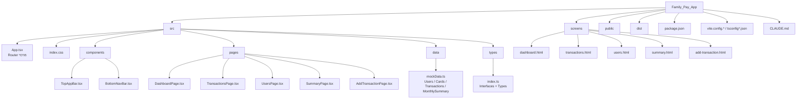

# Project Structure Diagram

```mermaid
flowchart TD
    A[Family_Pay_App] --> B[src]
    A --> C[screens]
    A --> D[public]
    A --> E[dist]
    A --> F[package.json]
    A --> G[vite.config.* / tsconfig*.json]
    A --> H[CLAUDE.md]

    B --> B1[App.tsx<br/>Router מרכזי]
    B --> B2[index.css]
    B --> B3[components]
    B --> B4[pages]
    B --> B5[data]
    B --> B6[types]

    B3 --> B31[TopAppBar.tsx]
    B3 --> B32[BottomNavBar.tsx]

    B4 --> P1[DashboardPage.tsx]
    B4 --> P2[TransactionsPage.tsx]
    B4 --> P3[UsersPage.tsx]
    B4 --> P4[SummaryPage.tsx]
    B4 --> P5[AddTransactionPage.tsx]

    B5 --> D1[mockData.ts<br/>Users / Cards / Transactions / MonthlySummary]
    B6 --> T1[index.ts<br/>Interfaces + Types]

    C --> S1[dashboard.html]
    C --> S2[transactions.html]
    C --> S3[users.html]
    C --> S4[summary.html]
    C --> S5[add-transaction.html]
```
